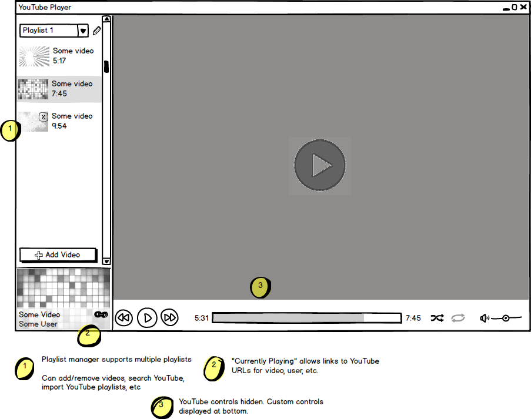

Electron YouTube Player
=======================

This is a desktop app created using [Electron](http://electron.atom.io/), written using React and Redux. It manages playlists of YouTube videos, and plays them in various ways.

Installing/Running
------------------

Requires Node.js. Tested on Node.js 4.0.

```
npm install
npm start
```

Mock
----


